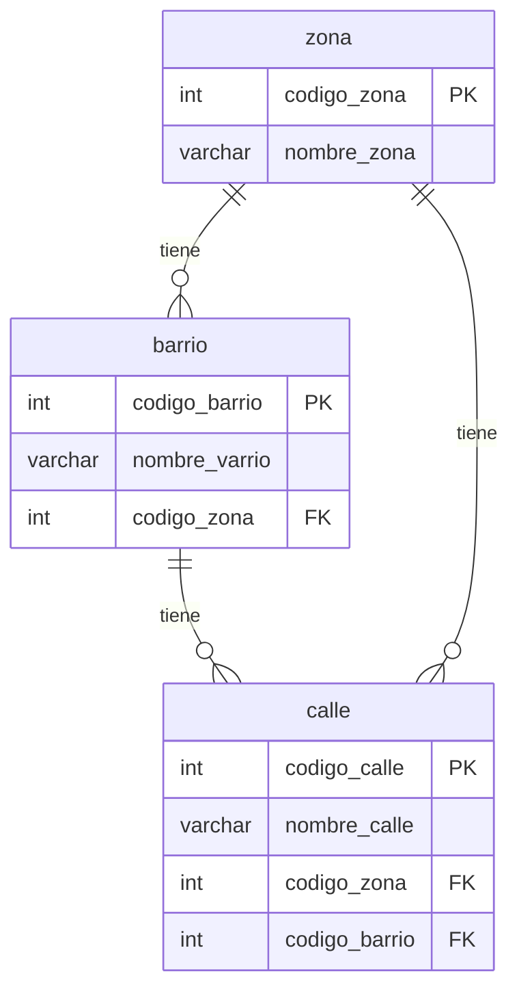

Sistema de Zonas, Barrios y Calles

- Tablas:
  - zona (codigo_zona, nombre_zona)
  - barrio (codigo_barrio, nombre_barrio, codigo_zona)
  - calle (codigo_calle, nombre_calle, codigo_zona, codigo_barrio)

